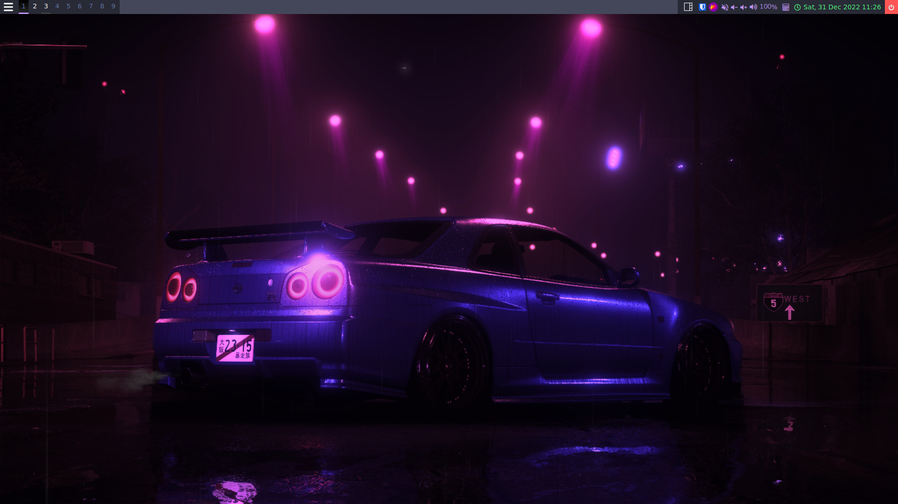

# Qtile configuration file

## 🖥️ Screenshot

## 🤔 What is Qtile?

[Qtile](http://www.qtile.org/) is a window manager written and configured in Python🐍. It is hackable and lightweight, you can install it among other desktop environments and standalone WM's.
